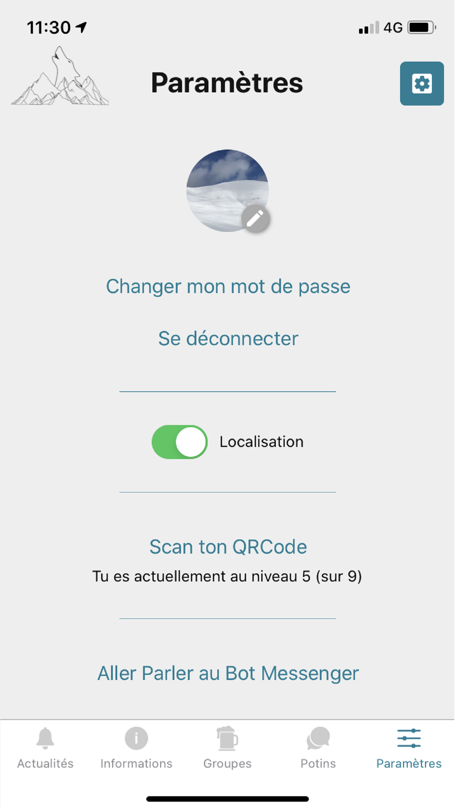

# Application SKI'UTC 

React native application for the SKI'UTC association at UTC.
Important Links : 
- Apple Store : https://apps.apple.com/fr/app/skiutc/id1492627886
- Play Store : https://play.google.com/store/apps/details?id=fr.utc.assos.skiutc
- reposotiry Rest API of the application : https://github.com/ski-utc/skiutcserverapp

Table of Contents
=================
  * [Screens](#screens)

Screens
=======

  
  
  
  
  
  
  

