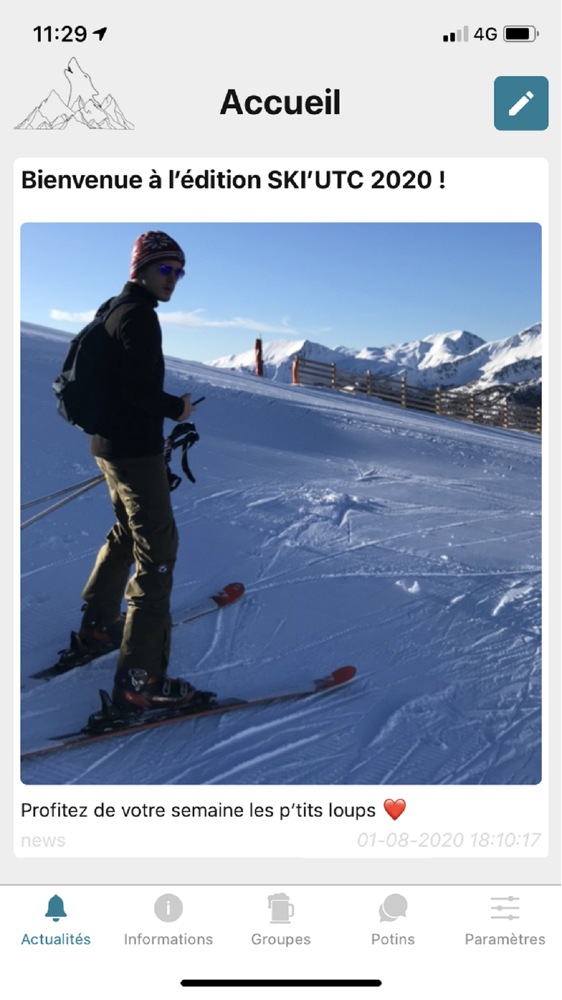

# Application SKI'UTC 

React native application for the SKI'UTC association at UTC.
Important Links : 
- Apple Store : https://apps.apple.com/fr/app/skiutc/id1492627886
- Play Store : https://play.google.com/store/apps/details?id=fr.utc.assos.skiutc
- reposotiry Rest API of the application : https://github.com/ski-utc/skiutcserverapp

Table of Contents
=================
  * [Screens](#screens)
  * [Informations](#informations)
  * [Authors](#authors)
  * [Licence](#licence)
  
Screens
=======

  
  
  
  
  
  
  

Informations
======

SKI'UTC is the application of the trip organized by the University of Technology of Compiègne each year. Thanks to this application, you will be able to connect as soon as you participate in the edition of the current year, and take advantage of different modules:

- Home: Consult the information of the day and the following days

- Information: Find the team contacts and the emergency contacts. Also find the piste map or the schedule for the week

- Gossip collected by the team each evening / publish their gossip which will be awaiting validation by a member of the team

- Group: Create groups of friends to launch personalized notifications and see where they are in the station

- Settings: Manage your accounts and your settings, add a profile photo, participate in the QRCode animation for the week or chat directly with the SKI'UTC facebook bot.

Authors
=======
* **[PAIGNEAU Hugo](https://github.com/hugofloter)** - *Initial work*
* **[RICHARD Quentin](https://github.com/qprichard)** - *Initial work*
* **[LEBRE Clément](https://github.com/clebre)** - *Initial work*

Licence
=======

Cette application est soumise à la licence [Beerware](http://fr.wikipedia.org/wiki/Beerware).
